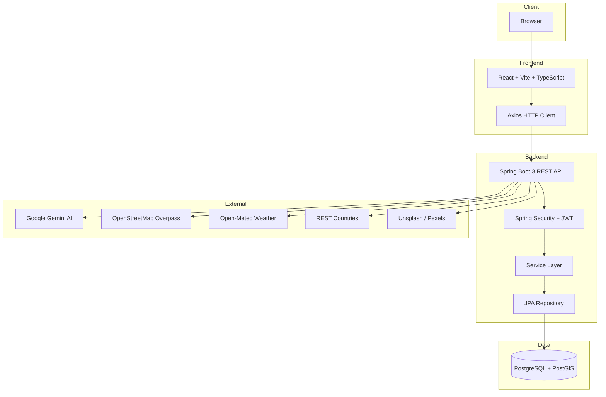
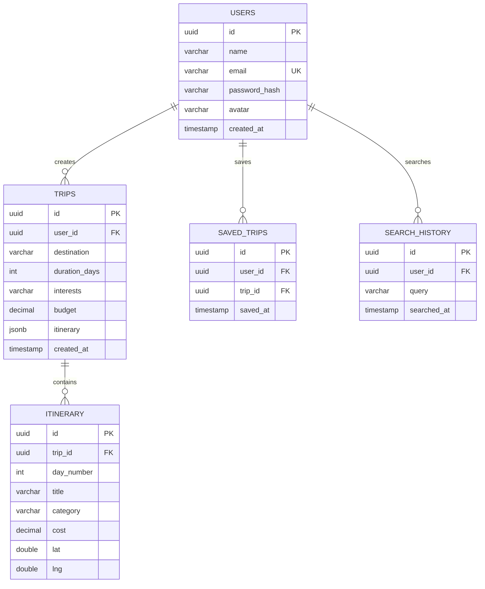

<div align="center">

# ✈️ TripPilot AI

### AI-Powered Travel Itinerary Planner

**Plan smarter. Explore more. Travel like a local — powered by real location, weather, and country intelligence.**

[](https://trip-pilot-delta.vercel.app)
[](https://trip-pilot-ogsq.onrender.com/health)

[](https://react.dev)
[](https://www.typescriptlang.org)
[](https://vitejs.dev)
[](https://tailwindcss.com)
[](https://spring.io/projects/spring-boot)
[](https://www.java.com)
[](https://jwt.io)
[](https://www.postgresql.org)
[](https://postgis.net)
[](https://deepmind.google/technologies/gemini/)
[](https://www.openstreetmap.org)
[](https://vercel.com)
[](https://render.com)

</div>

---

## 📖 Project Description

**TripPilot AI** is an end-to-end, AI-powered travel planning platform that generates **personalized itineraries** from a traveler's destination, budget, travel style, and interests. Built as a full-stack application, it combines a modern React frontend with a secure Spring Boot backend, a PostgreSQL + PostGIS database, and **free, real-world data sources** — OpenStreetMap's Nominatim & Overpass APIs for locations and points of interest, Open-Meteo for live weather, and Google Gemini for intelligent itinerary generation.

Users can register and log in with JWT-based authentication, search any destination in the world, and instantly receive a day-by-day itinerary with real POIs, mapped on an interactive Leaflet map, complete with weather, country information, and budget planning — then save it all for later.

---

## 🚀 Live Demo

| | URL |
|---|---|
| 🌐 **Frontend** | <http://trip-pilot-git-main-ffluck2004s-projects.vercel.app/> |


> **Demo credentials** — register a free account, or use the seeded guest account to explore instantly.

---

## ✨ Features

| Feature | Description |
|---|---|
| 👤 **User Registration** | Create a personal account in seconds |
| 🔐 **Secure Login** | Session-based auth with hashed credentials |
| 🎫 **JWT Authentication** | Stateless token auth on every protected request |
| 🤖 **AI Trip Generation** | Personalized day-by-day itineraries from interests, budget & travel style |
| 🔎 **Destination Search** | Search any city or country via geocoding |
| 🗺️ **Interactive Maps** | Live Leaflet + OpenStreetMap layer with itinerary markers |
| 🌦️ **Weather Forecast** | Real-time conditions via Open-Meteo |
| 🌍 **Country Information** | Country-level details for context and planning |
| 🏛️ **Tourist Attractions** | Real POIs fetched from OpenStreetMap by interest |
| 💾 **Save Trips** | Persist and reload generated itineraries |
| 📱 **Responsive Design** | Seamless experience across mobile, tablet & desktop |
| 🎨 **Modern UI** | Polished, high-contrast interface with smooth animations |


---

## 🏗️ Project Architecture



**Request flow:** `Browser → React → Axios → Spring Boot → Security → Service Layer → JPA → PostgreSQL + PostGIS`, with Gemini, OpenStreetMap, weather, country, and image APIs plugged into the service layer.

---

## 🗂️ Folder Structure

```text
trippilot/
├── 📁 backend/                         # Spring Boot 3 API
│   └── src/main/java/com/trippilot/
│       ├── 📁 config/                  # CORS, security config, DB URL post-processing
│       ├── 📁 controller/              # REST controllers (auth, trips, reservations…)
│       ├── 📁 dto/                     # Request/response DTOs
│       ├── 📁 entity/                  # JPA entities (User, Trip, Itinerary…)
│       ├── 📁 repository/              # Spring Data JPA repositories
│       ├── 📁 security/                # JWT filters, tokens, auth entry points
│       └── 📁 service/                 # Business logic + external API clients
│       └── 📁 resources/               # application.yml, Flyway migrations
├── 📁 frontend/                        # React + Vite + TypeScript SPA
│   └── src/
│       ├── 📁 api/                     # HTTP client & live-mode services
│       ├── 📁 components/              # UI screens & shared components
│       └── 📁 index.css                # Tailwind CSS styles
├── 📄 docker-compose.yml               # PostgreSQL + PostGIS for local dev
├── 📄 render.yaml                      # Render blueprint (backend + DB)
├── 📄 vercel.json                      # Vercel build/output config
└── 📄 README.md
```

---

## 🛠️ Installation

### 1️⃣ Clone the repository

```bash
git clone https://github.com/ffluck2004/Trip-Pilot.git
cd Trip-Pilot
```

### 2️⃣ Install the frontend

```bash
cd frontend
npm install
npm run dev          # http://localhost:5173
```

### 3️⃣ Install the backend

```bash
cd backend
./mvnw clean install
```

### 4️⃣ Configure PostgreSQL

Create a database and set the env vars below (see **Environment Variables**). For a zero-setup local database:

```bash
docker compose up -d        # starts postgresql + postgis with PostGIS enabled
```

### 5️⃣ Run Spring Boot

```bash
cd backend
./mvnw spring-boot:run      # http://localhost:8080
```

### 6️⃣ Run React (production build)

```bash
cd frontend
npm run build && npm run preview
```

---

## 🔧 Environment Variables

### Frontend (`.env`)

```env
VITE_API_BASE_URL=http://localhost:8080/api/v1
```

### Backend

```env
DATABASE_URL=jdbc:postgresql://localhost:5432/trippilot
DATABASE_USERNAME=your_db_user
DATABASE_PASSWORD=your_db_password
JWT_SECRET=your_super_secret_jwt_key
GEMINI_API_KEY=your_gemini_api_key
```

| Variable | Required | Description |
|---|---:|---|
| `DATABASE_URL` | ✅ | JDBC connection string for PostgreSQL |
| `DATABASE_USERNAME` | ✅ | Database user |
| `DATABASE_PASSWORD` | ✅ | Database password |
| `JWT_SECRET` | ✅ | Secret used to sign JWT tokens |
| `GEMINI_API_KEY` | ✅ | Google AI Studio API key for itinerary generation |

---

## 🔌 API Endpoints

| Method | Endpoint | Description | Auth |
|---|---|---|---|
| `POST` | `/api/v1/auth/register` | Register a new user | ❌ |
| `POST` | `/api/v1/auth/login` | Authenticate & receive JWT | ❌ |
| `GET` | `/api/v1/auth/profile/{userId}` | Fetch user profile | ✅ |
| `POST` | `/api/v1/trips/generate` | Generate an AI-powered trip | ✅ |
| `GET` | `/api/v1/trips/user/{userId}` | List user's saved trips | ✅ |
| `GET` | `/api/v1/places` | Explore available places | ✅ |
| `GET` | `/api/v1/places/{id}` | Place details | ✅ |
| `GET` | `/api/v1/reservations/user/{userId}` | User reservations | ✅ |
| `GET` | `/api/v1/expenses/trip/{tripId}` | Trip expenses | ✅ |
| `POST` | `/api/v1/gemini/chat` | AI travel chat assistant | ✅ |
| `GET` | `/api/v1/admin/analytics` | Admin dashboard analytics | ✅ |
| `GET` | `/api/v1/admin/users` | Admin user management | ✅ |
| `GET` | `/api/v1/admin/places` | Admin place management | ✅ |
| `GET` | `/health` | Backend health check (Render) | ❌ |

> 🔐 **Auth** columns marked ✅ require a `Bearer <JWT>` token in the `Authorization` header.

---

## 🗄️ Database Design



| Table | Purpose |
|---|---|
| **Users** | Account credentials, profile & auth data |
| **Trips** | Generated itineraries with destination, budget & interests |
| **Itinerary** | Day-by-day plan items with POI coordinates & costs |
| **SavedTrips** | Bookmarks linking users to their favorite trips |
| **SearchHistory** | Destination search log for recommendations |

---

## 🔐 Security

- **JWT Authentication** — stateless `Bearer` tokens signed with `JJWT` (HS256), validated on every protected request via a dedicated security filter chain.
- **Password Encryption** — credentials hashed with Spring Security's `BCryptPasswordEncoder`; plaintext is never stored.
- **Protected Routes** — role-aware `SecurityConfig` restricts admin and user endpoints; invalid/expired tokens degrade gracefully without crashing the API.
- **Spring Security** — layered defense with method-level authorization and secure CORS configuration that keeps credentials safe while allowing the Vercel frontend to talk to the Render backend.

---

## 🚀 Future Improvements

- 🏨 **Hotel Booking** — real inventory & booking flows
- ✈️ **Flight Search** — live pricing via flight APIs
- 💸 **Expense Tracker** — shareable trip budgets
- 📴 **Offline Trips** — cached itineraries with offline maps
- 👥 **Collaborative Planning** — invite friends & edit trips together
- 💬 **AI Chat Assistant** — conversational travel concierge

---

## 🧗 Challenges Faced

| Challenge | Solution |
|---|---|
| **Production deployment** | Split deployment — Vercel (frontend) + Render (backend) + managed PostgreSQL; Render uses a multi-stage Docker build with a `/health` probe for free-tier cold starts |
| **API integration** | Layered service abstraction around Nominatim/Overpass/Gemini/Open-Meteo with in-memory caching, timeouts and graceful fallbacks so the app never breaks when a provider is slow or rate-limited |
| **Authentication & CORS** | Secure JWT pipeline + strict CORS rules; fixed the classic Spring `allowCredentials(true)` + wildcard-origin conflict so preflight requests return clean `200`s |
| **Database configuration** | Automatic Render `postgresql://` → `jdbc:postgresql://` URL transformation with credentials extracted from the connection string — zero manual config on deploy |
| **Map integration** | Real interest-based POIs from Overpass rendered as Leaflet markers on OSM tiles, with curated fallbacks and AI enrichment for a rich map experience |

---

## 🎓 Learning Outcomes

- ⚛️ **React + TypeScript + Vite** — modern component architecture, hooks, and state management
- 🌱 **Spring Boot** — REST API design, DI, layered services, and bean configuration
- 🔗 **REST APIs** — consuming & exposing clean, versioned JSON endpoints
- 🎫 **JWT** — token issuance, validation, and stateless security filters
- 🐘 **PostgreSQL** — relational modeling, JPA/Hibernate mapping, and Flyway migrations
- 🗺️ **PostGIS** — geospatial queries for location-aware itinerary data
- ☁️ **Deployment** — CI-friendly pipelines across Vercel, Render, and Docker
- 🤖 **AI Integration** — prompt engineering and structured JSON output from Google Gemini

---

## 🤝 Contributing

Contributions are welcome! 🎉

1. 🍴 Fork the repository
2. 🌿 Create a feature branch: `git checkout -b feature/amazing-feature`
3. ✍️ Commit your changes: `git commit -m "feat: add amazing feature"`
4. 📤 Push to the branch: `git push origin feature/amazing-feature`
5. 🚀 Open a Pull Request

Please make sure your code follows the existing style and that `tsc --noEmit` (frontend) and `./mvnw test` (backend) pass.

---

## 📄 License

This project is licensed under the **MIT License**. See the [LICENSE](LICENSE) file for details.

---

## 👨‍💻 Author

<div align="center">

### Falak Rangari

**Full-Stack Developer**

[](https://github.com/ffluck2004)
[](https://ffluck2004.dev)
[](https://www.linkedin.com/in/ffluck2004)
[](mailto:falakrangari@gmail.com)

</div>

---

<div align="center">

**Made with ❤️ and ☕ — TripPilot AI**

</div>
